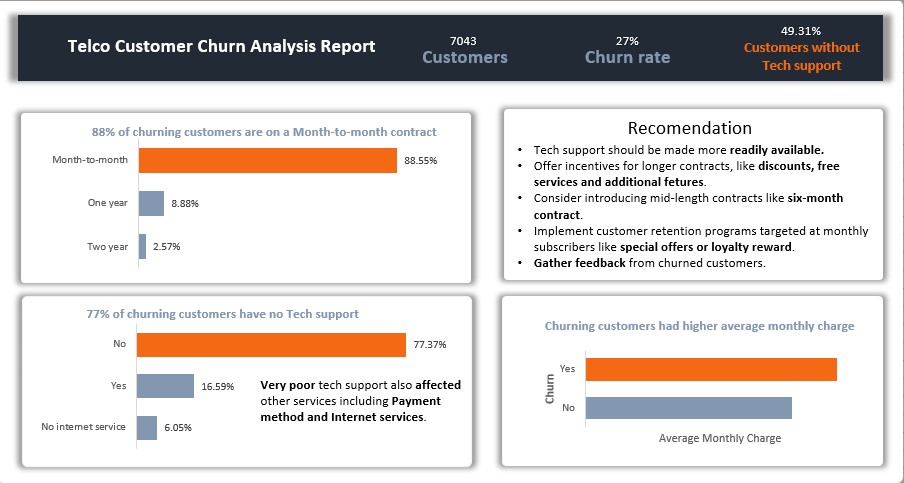

# 
 About the Dataset
## 
The dataset includes information about:
- Customers who left within the last month - the column is called Churn
- Services that each customer has signed up for -phone, multiple-lines, internet, online security, online backup, device protection, tech support, streaming TV and movies.
- Customer account information - how long they have been customers, contract, payment method, paperless billing, monthly charges, and total charges.
- Demographic info about customers - gender, age range, and if they have partners and charges.

### 
Objective :
The objective of this analysis is to understand the churning pattern and advice the stakeholders on how to reduce churn.

# 
 Analysis
**The project analysis is found in "Telco Customer Churn Analysis.ipynb**"

- ## STEPS for the analysis using python
- Import the data
- Data preparation
- Analysis
- Summary
- Recommendations

- ## Project was also executed using Power BI and Microsoft Excel
- After the necesary data preparation, the following reports were produced.
- 
- 

## 
Key Insights

1. Month-to-month Contract type and absence of Tech support are the biggest causes for customers churning.
2. Though some other services like payment type, intrnet service, online security, online backup, paper billing, device protection and multiple lines are poorly available to the churning customers, these services are strongly influenced by availability of Tech support.
3. On average most customers who churned had higher monthly charges.

## 
Recommendations

1. Prioratize TECH SUPPORT making it more readily available to the customers.
2. Offer incentives for longer contracts like discounted rates, free services, or additional features.
3. Consider introducng MID-LENGTH contracts like six-month contract.
4. Get feedbacks from churned customers.
5. Clearly communicate and educate customers on the benefits of long-term contracts like cost-saving and locked-in rates
6. Implement customer retention programs that target subscribers with month-to-month contracts. this could be in form of special offers or loyalty rewards.
